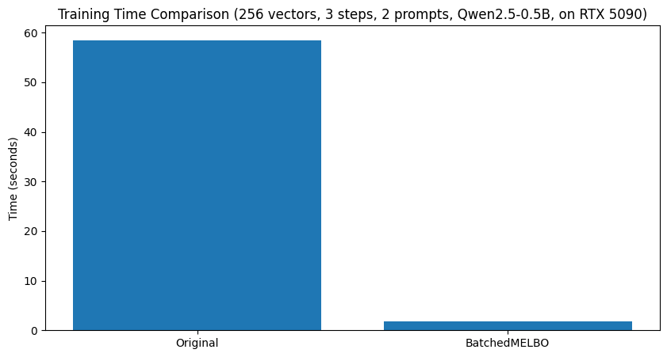

# batched-melbo

## Motivation

Unsupervised steering vectors (known by folk as MELBO) is an elicitation technique to uncover hidden behaviours in LLMs. However, the original implementation does not leverage GPU parallelization and trains vectors sequentially. This means training is slow and there is huge headroom for speedup.

This repo, batched MELBO, trains vectors in parallel to significantly speedup training, usually OOMs more (see image below, [see full notebook](notebooks/batched_melbo_performance.ipynb)), while [retaining full effectiveness of the original method](notebooks/batched_melbo_validation.ipynb). This makes hyper-parameters sweeps practical, which we have internally observed to be paramount for studying some behaviours to be elicited.


_Training time comparison between original MELBO and batched MELBO across different numbers of steering vectors._

The reason we have created a separate repo is mainly to give us freedom in altering and evolving the original training objective (maybe take some inspirations from [this](https://www.lesswrong.com/posts/ioPnHKFyy4Cw2Gr2x/mechanistically-eliciting-latent-behaviors-in-language-1?commentId=Rm7hhD2qgfh7Za4LA)?).

## Usage

Copy `src/batched_melbo.py` into your project.

```python
from batched_melbo import BatchedMELBO

steering = BatchedMELBO(
    ... # parameters
)
```

## Changes

1. Only residual stream vectors.
2. Adds support for mixed precision training.
3. Uses PyTorch hooks to steer the model instead of mutating the model.

## About Us

We are doing research on backdoors and sleeper agents, trying to understand the what makes them elicitable, removable, and detectable to create sleeper agents that are better organisms of misalignment. If you have ideas, reach out!
